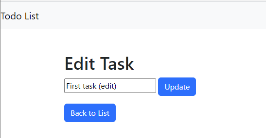
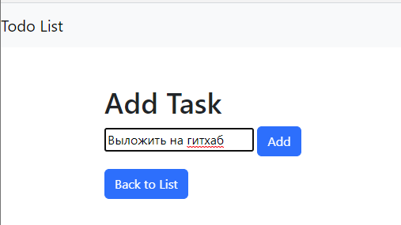
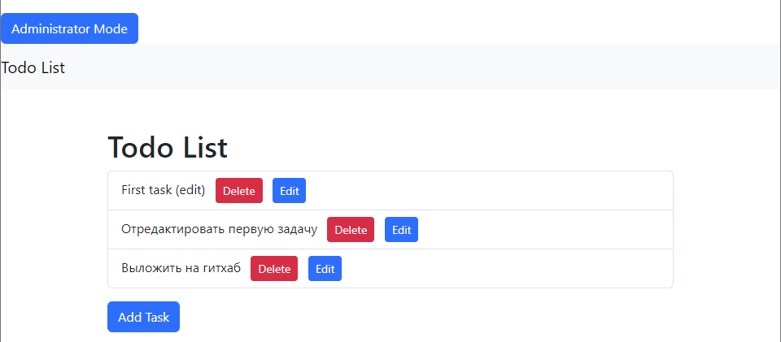

# Django To-Do List Project

Это простой проект списка дел, построенный на Django. 
Он позволяет пользователям добавлять, редактировать и удалять задачи в списке дел.

## Функции

- Добавление новых задач в список дел.
- Редактирование существующих задач в списке дел.
- Удаление задач из списка дел.
- Доступ к режиму администратора для управления задачами и другими моделями.

## Использование

- Чтобы просмотреть список дел и управлять им, надмите на кнопку "Administrator mode"
- Нажмите на "Add Task", чтобы добавить новую задачу в список.
- Каждая задача имеет кнопки для удаления или редактирования.
- Чтобы перейти в режим администратора и управлять задачами и другими моделями:
    - Перейдите на [http://localhost:8000/admin/](http://localhost:8000/admin/).
    - Войдите в систему, используя учетные данные суперпользователя, созданные ранее.
